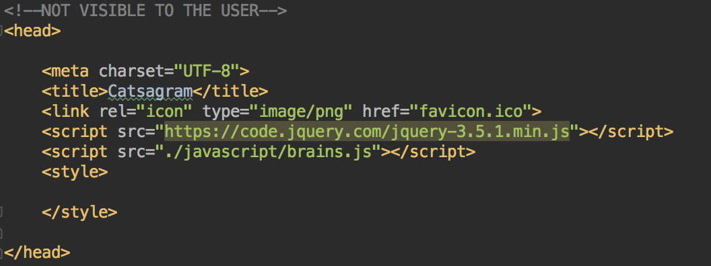
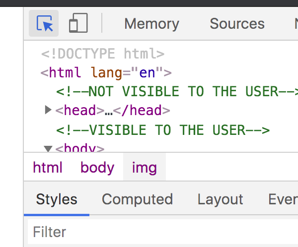
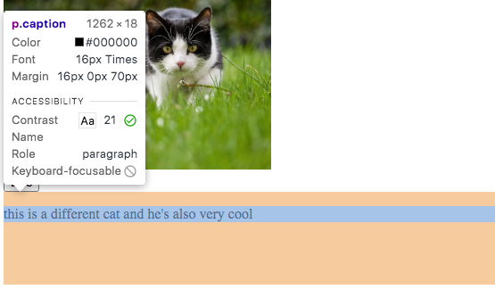
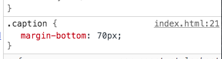
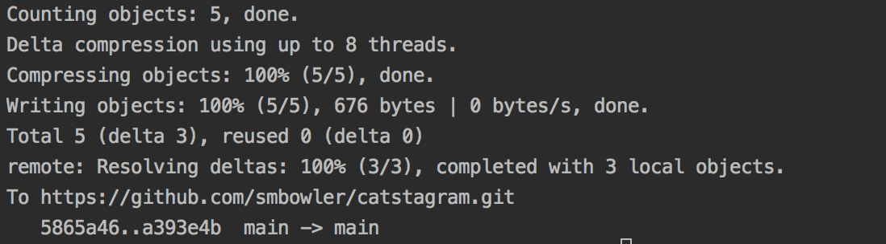

# Catstagram  
A full-stack of a web-based application, modeled after Instagram but with cats. 

## Part III: Make Catstagram Look Modern using CSS
Now that you have 5 photos of cats on your Catstagram, let's take a step back and ask ourselves a question: 

**Does this site look like a modern web application? Does it look like applications that I like to use?** Notice, the question is not - does the site look ***good***? This is subjective. 
Beauty is in the eye of the beholder. Discuss for a minute. 

#### Investigate and Discuss
We have already done some coding. From the options below, what have we built so far? 

1. Javascript
2. Database
3. **HTML**
4. CSS
5. All of the Above

Yes, we have already built the **structure and content** of the website, the HTML.
Next, in order to make the site look pretty, from the list above what language are we going to use? 
 
#### TODO #9: Add Style Tags in the Head
In order to start adding CSS, we have to add ```<style> </style>``` tags into the head of 
our ```index.html``` file. Inside of the opening and closing ```style``` tags, we'll put all of the CSS rules
that will make Catstagram look modern. 

    a) Locate the  <head>  tag
    b) Within the <head>  tag, navigate to the line underneath the  <script></script> tag
    c) Add a set of opening and closing  <style></style>  tags
    d) Now, "open up" the <style> tag by putting your cursor in between the opening and closing tags
    and pressing enter. It should look like this: 

    
    e) We are going to pass in some style rules to style our page in the next ToDo, but for now, save your work in Gitpod

 
#### TODO #10: Style the Title and Subtitle

    a) Inside the  <style>  tag, add a class called "brand-font" that has one property 
    of font-style with a value of 'italic'. Don't forget the semi-colon at the end!
    b) Add a class attribute of the same name inside the opening tag of your <h1> and <h5> tags
    c) Save your work in Gitpod and then refresh your preview. You should see your title and sub-title in italics

#### TODO #11: Style the Images

    a) Inside the `<style>` tag, add a CSS rule for all  tags that makes all images the same width:
        * Selects a property of "width"
        * With a value of 300px
    b) Save your work in Gitpod and then refresh your preview. You should see all of your pics have the same width

#### TODO #12: Add Some Space Underneath the Captions

When you look at your Catstagram, it is kind of hard to tell which captions
are with which photos. In order to make this more clear, we're going to add some 
space underneath each of captions. 

    a) Inside the <style> tag, add style rule with a class selector called ".caption". (Don't forget the period before
    the class name!)
    b) The selector `.caption` should set the following rule as a property within its code block:
               margin-bottom: 70px
    c) Now add this class attribute to each of the 5 paragraph tags you created below within your <body>. 
    c) Save your work in Gitpod and then refresh your preview. You should see space underneath all of your captions
    
    
#### TODO #13: Open the Console and Select an Element
When we are working with CSS, it is really helpful to use the Developer Tools to experiment 
with different styles. In order to do this, follow the steps below within your Google Chrome browser:

    a) Right click the page and select "Inspect." (If you are working with a Chromebook, you might not have this capability, in which case just read through this next section.)
    b) Click on the box with the cursor icon in the top left corner of the Inspect Tools window. When
    you have selected it, it will turn blue like below:


    c) Once that icon is blue, hover over one of the captions on your Catstagram page. It
    will turn a different color, like below:


    d) Click on the caption and then look in the bottom section of the 
    Developer Tools. You should see your css rule called .caption, like below:


    e) Now click on the property value, where it says "70px" and using your up and down arrow keys,
    play around with the value while observing what is happening on your page. Is the space underneath each comment changing?
    f)Refresh the page. Notice, did your changes stick?
    
#### TODO #14: Center all of the content on the page
Right now, all of the content is squished over to the left side of the page, right?
We want to center everything, so that the images, like count, and caption are in the center of the page.
In order to do this, we're going to put everything inside of a  ```<div></div>``` and then we're going to add some 
style rules to that ```<div>```

    a) Below the <h5> element that is holding your subtitle at the top of the index.html file, add an code comment stating <-- PICTURE CONTAINER  --> 
    b) Below this code comment, add an opening <div>
    c) After the the caption of your LAST photo, add the closing tag </div>
    d) Highlight everything inside these new opening and closing <div> </div> tags, and press indent,
    so that it is clear to see that the <div> is the parent tag of all of this content. 
    e) Next, add a class attribute to the opening tag of the <div> with the label "pic-container" 
    f) Add a rule inside of the <style></style> tags in the <head> that looks like this:
    
        
       .pic-container {
            display: flex;
            flex-direction: column;
            align-items: center;
        }

#### TODO #15: Have fun w/ CSS
Now, have some fun with the style of your Catstagram application. Below is a non-exhaustive list of style elements you could change

    - Background color/ image
    - Font color / image
    - Indentation of captions/likes underneath each photo
    - Border around each photo
    - Indentation of the title of the application
    - Adding the favicon next to the title of the application
        
    
#### TODO #16: Review your work and check for errors
A good developer always reviews their work before they commit it. Review all of your work and check for the following:

    * Correct indentation in the CSS rules
    * Ensure the page looks like it is supposed to look:
        * Title/subtitle are italicized
        * Images are the same width
        * There is space under each caption
        * All content is centered
    * Images are centered
    * There are semi-colons at the end of each property
    * All TODOs are complete
    
    
    
#### TODO #18: Push your code to Github
    * First, open a terminal window by clicking at the top Window > New Terminal
    * Then run each of the following commands one by one:
        * ```git add .  ``` then hit Enter. Don't forget the ```.```
        * ```git commit -m 'insert specific message about what you are saving'``` 
              This second command can be tricky.You want to write a message inside the qoutation marks that describes what you are changing. 
              Think of this as a sticky note message. Press Enter. 
        * ```git push``` then press Enter. 
        * If you successfully ran these commands one at a time, your terminal window should look like this:
        
  
           
        * Checkout the live site on your portfolio and make sure the changes are appearing.

#### TODO #19: Click on the javascript folder, follow the README
To move forward on completing Catstagram, click [HERE](https://github.com/OperationSpark/catstagram/tree/master/javascript) or scroll up to the top of this Github repo and click
on the "javascript" folder. This will take you to the README with instructions for how to make
Catstagram functional. 
