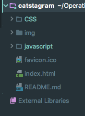
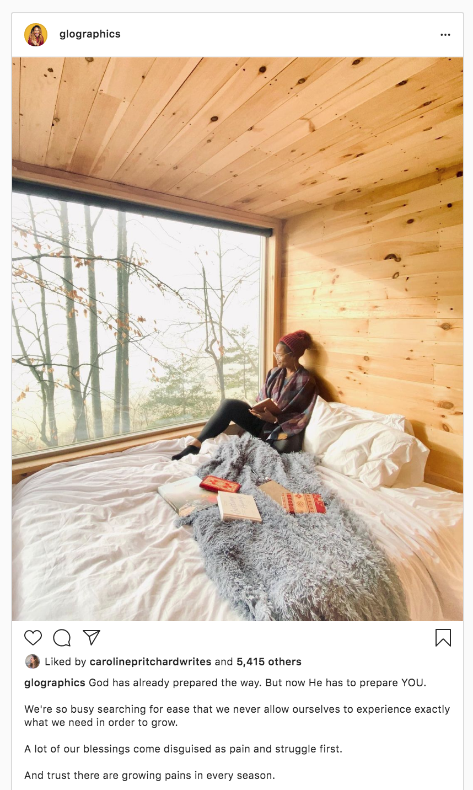

# Catstagram  
A full-stack of a web-based application, modeled after Instagram but with cats. 

## Instructions for Installing Catstagram
1. Open new terminal
2. Run the folloiwng commands in your terminal
- `cd projects`
- `git clone https://github.com/OperationSpark/catstagram`
- `cd catstagram`
- `rm -rf .git* .master`
- `cd ../..`
5. Open up the Catstagram folder (it's in the projects folder), and look for the index.html file

## First, Answer This Question
*Start here young padouan and riddle us this question:*
* Do you use Instagram, Twitch, or Soundcloud, or any other web application? Do you *actually* know how they work? **PAUSE.**
* If the answer was *"No,"* that's okay. Even though over a billion people use these applications, 99.9%
of them don't either. **We want you to be in that .1%** of 
people that can explain to your friends and family exactly how every web-based project works, front to back. 

## How?
*How are you going to learn how web applications work?*
* You are going to learn by **building your own version of Instagram**, except only with
pictures of...cats.

## Why?
*Why you should want to know how web-based applications work:*
* You are alive in 2021, right!? The internet has already changed the way you live, learn, work, think, and play, right?! 
* Whether you choose to pursue a career building world-changing software or you become a musician, knowing how applications
work will open up an entirely new world to you, while also making you a more engaged, thoughtful member of society. 

## Part I: Things to Know

### File Structure / File Tree

Before we jump in, let's make sure what we know is inside of this repository. Let's look
at our file tree in Gitpod or scroll-up and look at the repo in Github. They are the same.



* This project, like most projects, has its own folder, that contains the following:
    * **CSS Folder:**
        * This folder contains the README for Part III of this project that deals with styling Catstagram. 
        When you're ready to start Part III, navigate to the CSS folder and scroll down to see the README file, 
        just like you did when you opened up this repo.
    *  **img folder**:
        * This is a folder that contains images that are used throughout this README and images that you will use in this project (specifically the heart icon from Instagram).
    * **javascript folder:**
        * This folder contains the README for Part IV of this project, when you are going to give
        Catstagram some functionality using javascript.
    * **favicon.ico**
        * This is the icon that appears on the tab in the browser. It stands for "favorite icon"
    * **index.html page:**
        * This is the page that the browser loads and is the file that you should preview when you want to see this application or any application
    * **README**
        * This is the file that you are reading right now, that describes what this project is all about and how to proceed through it.   

### What is Github and Why/How Do you use it? 

#### What is Github?
 * Just like you save your work in Google Drive for school, software developers save their code in something called
 Github. 
 * When we did setup for this class, you created a repository for your code to live on Gitpod. You can think of a repository (repo for short),
 as a folder or locker for your code. 
 * Inside the locker, you put all of the files, images, and graphics you need to run
 your application. 
 #### Why do you use it?
 * Just like when you build a house, you can have multiple people working at the same time - painting, hanging drywall, etc - you can do the same thing with code.
 * It's important that everyone working on software be able to save their work in one place, so that everyone
 can know what progress has been made. 
 * Github allows developers to save their code so that everyone can see it.
#### When do you "push code"?
  * When you are ready to take a project live so that it will show up on your portfolio website, you will "push" your code up to your Github repository by following the instructions below.
  
 #### How do you use it?
 * First, go to Window > New Terminal in Gitpod. 
    * This will open up the terminal or bash window, which allows
 you to talk directly to your computer. Believe it or not, the first computer was just this window!
 * Once the terminal is open, you are going to run three different commands, pressing enter after each one. 
 * The first command: 
    * ```git add .  ``` then hit Enter. Don't forget the ```.```
    * ```git commit -m 'insert specific message about what you are saving'``` 
     This second command can be tricky. You want to write a message inside the qoutation marks that describes what you are changing. 
    Think of this as a sticky note message. Press Enter. 
    * ```git push``` then press Enter. 
 * If you successfully ran these commands one at a time, your terminal window should look like this after you run the ```git push``` command :
 
 * Now, go to your portfolio URL (githubUserName.github.io), inspect the page (right click  > inspect), refresh, and you should see your changes. 

 
 
## Part II: Preview index.html + Check for errors
Below you will find instructions on what TODO to build Catstagram. Take each bulletpoint one by one. Work in Google Chrome. 
There are **7** TODOs in Part II. Complete each one!


#### TODO #1: Investigate/Preview Index.html file
    a) Open the index.html file in Gitpod and look it over
    b) Ask yourself these questions:
        * Do I know what each of these lines of html do?
        * What should I expect to see when I preview this file? *Hint: What's inside the body tag?*
        * Do I see any errors, any opening tags or closing tags that are wrong?
    c) Right click on the file index.html and click "Preview with LiveServer" (if you have installed the LiveServer extension) or "Preview"
    d) Ask the question: 
        * Was I right? Am I seeing what I expected to see?
    e) Fix the errors in the html
    
You are going to see some script files in the head tag. Since these files are in the head, they are not
visible to the user. These script files tell the index.html that there are some other files that this application needs, namely
a brain.js file and the javascript library called jQuery, which we'll learn about later. 


## Part II continued: Build The Structure of Catstagram with HTML
Next you will build the structure of Catstagram so that you and your users can start to get value
from the applicaiton, i.e. see pics of cats!

#### TODO # 2: Add Basic HTML
    a) Open the "index.html" file in the file tree
    b) Inside the  <body> </body>, delete the content inside the <h1> element that says "THIS SHOULD BE VISIBLE TO YOU."
    c) Inside that <h1> element, add the site name "Catsagram." Save. You should see 'Catstagram' visible on your site now. 
    d) Below the h1 holding your title, add an <h5></h5> element with the caption "Sharing the World's cats" 
    e) Save your work in Gitpod
    f) Refresh the preview page of your index file. You should see a title and tagline for Catstagram

    
    
#### TODO #3: Add One Cat Image from a Source URL
    a) Below the <h5> tag, write a code comment that says <!--Cat Photo 1-->. This comment helps us organize our code and understand what we are putting where. 
    b) Now, create an  tag underneath that code comment
    c) Add an attribute inside the opening  tag for 'src'
    d) Search Google for an image of a cat, right click on the image, and select "copy image address"
    e) Inside the opening    tag, find the  'src'  tag and paste the url of the cat image so that 
    it looks like this  src="https://i.pinimg.com/originals/3b/4f/55/3b4f55f606f04ed5300d1bcf589c010e.jpg"
    f) Make sure this url ends in either .png or .jpg otherwise your image will not pull up!
    g) Save your work in Gitpod
    h) Return to Chrome and refresh the page. You should see your image on the website. It might be big or small, depending
    on the size of the image that you chose. 
 
#### Investigate and Discuss

Next, let's make sure we've added everything that goes along with a photo on Instagram. Look at the photo below. What else is associated with each photo? 
Where is each element located?
    * Like Button
    * Like Count
    * Caption


    
        
        
#### TODO #4: Add Like Button, Like Count, and Caption underneath the photo
    * Underneath the    tag, add the following code snippet:
   
 ````
    <div id="likeCount1"></div>
    
    <button id="likeBtn">Like</button> 
 ````
    
    * Underneath the  <button>  tag, add a  <p></p>  with a caption. Get creative!
    * Save your work in Gitpod
    * Refresh your preview. You should see a button, and a caption underneath the photo. You won't see the actual like count yet, but we will take care of that in another ToDO. 

#### TODO #5: Add 4 More Cat Pics with Like Count, Like Button, and Captions
    * Underneath the first image, like button, and caption, add four more images following the same steps as above. You want to make sure each
    photo you are including has the following:
        * a caption
        * a div with an id="likeCount" with the number of the photo it is (i.e. likeCount1, likeCount2,likeCount3, etc.) 
        * a button with an id="likeBtn". Similarly to the divs above, make sure each id has a unique number associated with it.
        * It's also best practice to add a code comment above each new photo, like below, so that it's easy to see where one photo stops
    and the other continues
        <!--Cat Photo 2-->  
    
    * Each time you add a photo, save your workspace in Gitpod, and you should see your cat images, like buttons, and captions show up in a column just like Instagram. Don't worry if your images are different sizes. We'll fix this later with CSS. 
    
    
    
#### TODO #6: Review your work and check for errors
A good developer always reviews their work before proceeding to commit it. Put on your good developer hat and verify that you have done the following:

    * Correct indentation
    * Opening and closing tags (except for img tag)
    * Corrected spelling/grammer mistakes
    * All 5 images are showing up
    * All 5 images have a likeCount div with the correct corresponding number
    * All 5 images have a likeBtn 
    * All 5 images have a caption 
    * All TODOs are complete

    
#### TODO #7: Push your code to Github
* First, if your terminal isn't currently open, open a terminal window by clicking at the top: **Window > New Terminal**
* Then run each of the following commands one by one:
    * ```git add .  ``` then hit Enter. _Don't forget the ```.```_
    * ```git commit -m 'insert specific message about what you are saving'``` 
          This second command can be tricky.You want to write a message inside the qoutation marks that describes what you are changing. 
          Think of this as a sticky note message. Then hit Enter.  
    * ```git push``` then press Enter. 
    * If you successfully ran these commands one at a time, your terminal window should look like this:
       

#### TODO #8: Click on the CSS folder, follow the README
To move forward on completing Catstagram, click [HERE](https://github.com/OperationSpark/catstagram/tree/master/CSS) or scroll up to the top of this Github repo and click
on the "CSS" folder. This will take you to the README with instructions for how to style 
Catstagram. 

