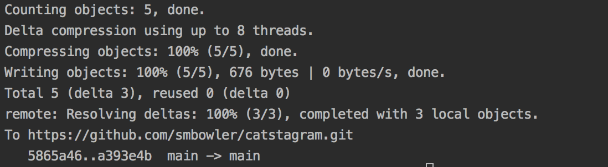

# Catstagram  
A full-stack of a web-based application, modeled after Instagram but with cats. 

## Part IV: Give Catstagram Some Functionality

#### Investigate and Discuss
We're making progress. From the options below, what have we built so far? 

1. Javascript
2. Database
3. **HTML**
4. **CSS**
5. All of the Above

Yes, we have already built the **structure and content** of the website, the HTML, and we have **styled** it using CSS. 
Next, we need to make the site have functionality. From the list above what language do you feel we are we going to use? 
    
    
#### TODO #20: Add an onClick function to the FIRST Button
As you get deeper into Javascript, you'll learn more about different ways to 
connect the HTML and Javascript together, including learning about frameworks that make this 
easy. For now, we're going to add a simple onClick event into the opening tag of the **FIRST** ```<button>``` only. After 
we add this onClick function into the button tag, we'll actually build the function in TODO #21. 

    a) Inside the opening <button> tag of the FIRST photo only, add the following code:
         onClick="likePhoto()"
    b) Confirm that the button element now looks like this:
           <button onClick="likePhoto()">Like</button>
    c) Save your work in Gitpod
    
The onClick event  is added into the opening tag of HTML elements and it allows you to 
execute a function anytime that element is clicked. In this case, we've added
it to a button.  
    

#### TODO #21: Write the function to be performed onClick
Now that we've added this function to the opening tag of the first button, we need to 
definte the function called  ```likePhoto``` in the brain.js file in order for us to use it!

    a) Navigate to brain.js in your Gitpod workspace (located in the javascript folder)
    b) Write a function called "likePhoto" that prints the word "Like" to the console.
    c) Save your work in Gitpod
    d) Navigate to your preview and press the button of the first photo to test the function! 
    d) If you are able to inspect the page, do so and open the console tab. 
    e) You should see the word "like" printed to the console each time you press the button, like this:
  
   

    

#### TODO #22: Create a variable to store the number of likes!
Now that we have a function that is working, we need to modify our javascript so that 
it keeps track of the number of likes on each photo. How can we do this?

    a) Inside the brain.js file, above your likePhoto function, add a variable called "counter1" and give it a value of zero 
    b) Modify your likePhoto function so that it increases the counter by one each time the function is called
    c) Instead of printing "like" to the console, now print the counter variable to your console. 
    c) Save your work in Gitpod and run your preview. You should see your counter value increasing in your console. 

    
#### TODO #23: Connect the Javascript to the HTML, using JQUERY.  

Ok, we've done a few things now to give Catstagram some functionality. To sum up what we've done:
   * We've written a function called likePhoto that we call when we click the first Like button on the first photo.  
   * We've added a variable called "counter1" to keep track of the likes
   * We've confirmed that our function and counter are working because we are printing to the console and to our website. 

Now that we know this, we are going to connect our javascript code with our HTML code, so that
when you click the like button, you will actually see the number of likes below each photo. In order to do this,
we're going to use a library called JQuery. The basic idea behind JQuery is called DOM manipulation, which basically means
it allows you to change the HTML using javascript. 


    a) Inside the likePhoto() function, add the following code snippet underneath your code that is already there
    
     
        document.getElementById("likeCount1").innerHTML = counter1;

Look over this code and see if you can figure out what's going on. Here are the basics: 
 * jQuery is calling a function called getElementById and passing in a parameter of "likeCount1", which is the id
present on the element in the opening tag of the HTML element. Go check it out.  
 * This function gets that HTML element and then jQuery allows us to change parts of that element, including what's called the "innerHTML"
 * So, this code snippet you just copied assigns a new value to the innerHTML of that div that is equal to the counter1 variable.
 
    
     b) Test out the function by saving your work in Gitpod, refreshing the index.html page, and clicking
     the Like btn underneath the first photo. 
    
     
        document.getElementById("likeCount1").innerHTML = counter1;


#### TODO #24: Modify the likePhoto function so it works on any button
Notice that the buttons below photos 2 through 5 don't work. How can you modify the function so that
it works for any photo? Consider these questions below.  

    a) Can you add a parameter to the function that allows you to increase the count of not just counter1, but counter2, counter3, etc?
    b) What could you add to each img element to clearly identify the number of each photo? Does adding a class or id seem appropriate here?
    c) How can you use a conditional so that the counter of each photo is increased, depending on which photo's like button is pushed?
    d) Can you modify the jQuery code so that it grabs the correct HTML div for each corresponding photo?
    e) What needs to be added to each call to your onClick() function in HTML?

#### TODO #25: Now, add a user object 
Below the likePhoto() function, add an object called user. It should contain the following keys:
 - name
 - name_last
 - followers, which should be an array of at least 5 names
 - profile_pic, which should be a string of a photo url that you want to be your profile picture. 


        a) Inside the brain.js file, underneath the likePhoto function, create an object with these keys and add your own values so that the object is complete:
            - name
            - name_last
            - followers
            - profile_pic
    
        b) Now go to the index.html file and add the following tags below the h5 tag that says  "Sharing the World's Cats"
    
    
       
       <div id="name"></div>
       <div id="name_last"></div>
       <div id="followers"></div>
       

   
   c) Now, inside the brain.js file, add the following code snippet:
       
        
    
    
        setTimeout(function(){ document.getElementById("name").innerHTML = user.name;}, 3000);
        setTimeout(function(){ document.getElementById("name_last").innerHTML = user.name_last;}, 3000);
        setTimeout(function(){ document.getElementById("followers").innerHTML = "Followers: " + user.followers.length;}, 3000);
        setTimeout(function(){ $("#profile_pic").attr("src", user.profile_pic);}, 3000);

Look at each of those code snippets and see if you can understand what is happening. You have not yet learned
what a setTimeout is, but basically it means that we are purposefully adding a delay to when these functions are called
in order to allow the HTML to be set by the javascript. You'll learn more about this in the advanced class. For now, see if you can
look at the jQuery and understand how we're using the object to adjust our HTML. 

#### Challenge
Look at the picture below. Can you add some CSS to get your Catstagram looking like instagram.com? Consider the bullet points below:

 

 * Look at the CSS property border-radius to adjust your profile picture
 * Add a bio to your user object and to your HTML and then add some jQuery inside of a setTimeout function to display your bio on your Catstagram.
 * Look into flexbox to see how you can adjust the CSS in order to place your profile picture to the left of your name and bio. 


#### TODO #26: Review your work and check for errors
A good developer always reviews her work before she commits it. Review all of your work and check for the following:

    * Correct syntax in javascript
    * Ensure the like button performs how it should
    images are centered
    * No errors in the console
    * All TODOs are complete
    
    
#### TODO #27: Push your code to Github
    * First, open a terminal window by clicking at the top Window > New Terminal
    * Then run each of the following commands one by one:
        * ```git add .  ``` then hit Enter. Don't forget the ```.```
        * ```git commit -m 'insert specific message about what you are saving'``` 
              This second command can be tricky.You want to write a message inside the qoutation marks that describes what you are changing. 
              Think of this as a sticky note message. Press Enter. 
        * ```git push``` then press Enter. 
        * If you successfully ran these commands one at a time, your terminal window should look like this:
           
 
        
        * Checkout the live site on your portfolio and make sure the changes are appearing.


